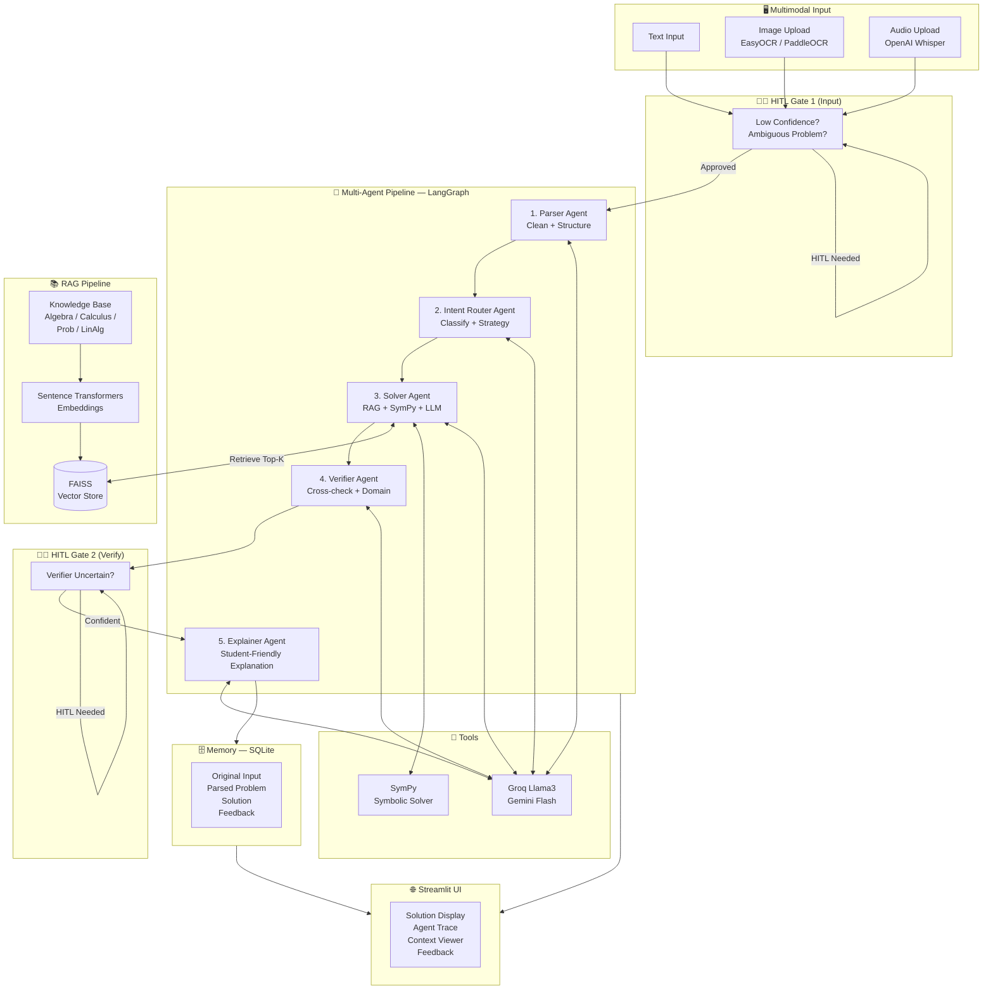

# 🧮 Multimodal Math Mentor

A production-ready AI application that solves JEE-level math problems from **text, image, or audio** using a multi-agent RAG pipeline, Human-in-the-Loop (HITL) confirmation, and persistent memory.

---

## Architecture Diagram



---

## Folder Structure

```
multimodal-math-mentor/
├── app.py                          # Streamlit frontend
├── requirements.txt
├── .env.example
├── README.md
│
├── backend/
│   ├── __init__.py
│   ├── config.py                   # All env vars & settings
│   ├── models.py                   # Pydantic data models
│   ├── main.py                     # FastAPI server
│   │
│   ├── agents/
│   │   ├── __init__.py
│   │   ├── llm_client.py           # Groq + Gemini unified client
│   │   ├── parser_agent.py         # Agent 1: Parse & clean
│   │   ├── intent_router_agent.py  # Agent 2: Classify & route
│   │   ├── solver_agent.py         # Agent 3: RAG + SymPy + LLM
│   │   ├── verifier_agent.py       # Agent 4: Verify solution
│   │   ├── explainer_agent.py      # Agent 5: Generate explanation
│   │   └── orchestrator.py         # LangGraph pipeline
│   │
│   ├── rag/
│   │   ├── __init__.py
│   │   ├── embeddings.py           # SentenceTransformers
│   │   ├── vector_store.py         # FAISS wrapper
│   │   ├── knowledge_base.py       # Build index from txt files
│   │   └── retriever.py            # High-level retrieval API
│   │
│   ├── multimodal/
│   │   ├── __init__.py
│   │   ├── ocr_processor.py        # EasyOCR / PaddleOCR
│   │   ├── audio_processor.py      # Whisper ASR
│   │   └── text_processor.py       # Text cleaning
│   │
│   ├── memory/
│   │   ├── __init__.py
│   │   └── memory_store.py         # SQLite CRUD
│   │
│   ├── tools/
│   │   ├── __init__.py
│   │   └── math_tools.py           # SymPy solver / calc tools
│   │
│   └── hitl/
│       ├── __init__.py
│       └── hitl_manager.py         # HITL request / response
│
├── data/
│   ├── faiss_index/                # Auto-generated on first run
│   ├── memory.db                   # Auto-generated SQLite DB
│   └── knowledge_base/
│       ├── algebra.txt
│       ├── calculus.txt
│       ├── probability.txt
│       └── linear_algebra.txt
│
└── tests/
    ├── __init__.py
    └── test_basic.py
```

---

## Tech Stack

| Layer | Technology |
|---|---|
| **Frontend** | Streamlit |
| **Backend** | FastAPI + Uvicorn |
| **Agents** | LangGraph (StateGraph) |
| **LLM (Primary)** | Groq — Llama3-70B (free) |
| **LLM (Reasoning)** | Google Gemini Flash (free) |
| **Embeddings** | SentenceTransformers `all-MiniLM-L6-v2` |
| **Vector Store** | FAISS (CPU) |
| **Math Engine** | SymPy |
| **OCR** | EasyOCR (or PaddleOCR) |
| **ASR** | OpenAI Whisper (local) |
| **Memory** | SQLite |
| **Data Models** | Pydantic v2 |

---

## Installation

### Prerequisites

- Python 3.10+
- Git
- (Optional) CUDA GPU for faster Whisper inference

### Steps

```bash
# 1. Clone / navigate to the project
cd multimodal-math-mentor

# 2. Create a virtual environment
python -m venv venv
# Windows
venv\Scripts\activate
# Linux/macOS
source venv/bin/activate

# 3. Install dependencies
pip install -r requirements.txt

# 4. Set up environment variables
cp .env.example .env
# Edit .env and add your GROQ_API_KEY and/or GEMINI_API_KEY

# 5. Verify installation
pytest tests/ -v
```

### Getting Free API Keys

| Service | URL | Free Tier |
|---|---|---|
| **Groq** | https://console.groq.com/ | 14,400 req/day |
| **Google Gemini** | https://aistudio.google.com/ | 1,500 req/day |

---

## Running Locally

### Start the FastAPI backend (Terminal 1)

```bash
python -m backend.main
# or
uvicorn backend.main:app --reload --port 8000
```

API docs available at: http://localhost:8000/docs

### Start the Streamlit frontend (Terminal 2)

```bash
streamlit run frontend/app.py
```

UI available at: http://localhost:8501

---

## API Endpoints

| Method | Endpoint | Description |
|---|---|---|
| `GET` | `/health` | Health check |
| `POST` | `/solve/text` | Solve from text input |
| `POST` | `/solve/image` | Solve from image (OCR) |
| `POST` | `/solve/audio` | Solve from audio (Whisper) |
| `POST` | `/hitl/respond` | Submit HITL human response |
| `POST` | `/feedback` | Submit correct/incorrect feedback |
| `GET` | `/memory/recent` | View recent session history |

---

## System Design

### Multi-Agent Pipeline (LangGraph StateGraph)

```
START → [parse] → [route] → [solve] → [verify] → [explain] → [save_memory] → END
                                              ↘ HITL gate ↗
```

**Agent 1 — Parser Agent**
- Receives raw text (from OCR, ASR, or direct input)
- Fixes OCR/ASR artefacts using LLM
- Outputs structured JSON: `{problem_text, topic, variables, constraints}`
- Triggers HITL if ambiguity detected

**Agent 2 — Intent Router Agent**
- Refines topic classification
- Selects solving strategy: `symbolic | numeric | step_by_step | hybrid | visual`
- Returns required mathematical techniques

**Agent 3 — Solver Agent**
- Retrieves top-K relevant formulas from FAISS knowledge base
- Attempts SymPy computation for exact answers
- Generates step-by-step solution with LLM
- Combines symbolic + LLM results in hybrid mode

**Agent 4 — Verifier Agent**
- Cross-checks solution for mathematical correctness
- Validates domain constraints (division by zero, sqrt of negative, etc.)
- Computes confidence score
- Triggers HITL if confidence < threshold

**Agent 5 — Explainer Agent**
- Generates student-friendly markdown explanation
- Lists key concepts and common JEE mistakes
- Uses Gemini Flash for better reasoning quality

### RAG Pipeline

1. Knowledge base `.txt` files are chunked (512 chars, 64 overlap)
2. Chunks embedded via `sentence-transformers/all-MiniLM-L6-v2`
3. Stored in FAISS `IndexFlatIP` (cosine similarity via L2-normalised embeddings)
4. Top-K retrieved chunks formatted as LLM context
5. Sources always shown in UI — no hallucinated citations

### HITL (Human-in-the-Loop)

Triggers when:
- OCR confidence < 0.75
- ASR confidence < 0.70
- Parser detects ambiguity
- Verifier confidence < 0.80
- User manually requests re-check

Human can approve, edit, or reject. Corrections are stored in SQLite and used for future suggestions.

### Memory (SQLite)

Each pipeline run stores:
- Original input text
- Parsed problem JSON
- Retrieved context
- Solution
- Verifier result
- User feedback

Used for:
- Session history display
- Similar problem retrieval
- OCR error auto-correction suggestions

---

## Deployment

### Streamlit Cloud

1. Push the repository to GitHub
2. Go to https://share.streamlit.io/
3. Connect your GitHub repo
4. Set `app.py` as the main file
5. Add secrets in the Streamlit dashboard:

```toml
# .streamlit/secrets.toml
GROQ_API_KEY = "your_key"
GEMINI_API_KEY = "your_key"
API_BASE_URL = "https://your-fastapi-backend.com"
```

> **Note:** You need to deploy the FastAPI backend separately (e.g. Render, Railway, Hugging Face Spaces with Docker).

### HuggingFace Spaces

Create a `Dockerfile`:

```dockerfile
FROM python:3.11-slim

WORKDIR /app
COPY . .
RUN pip install -r requirements.txt

EXPOSE 8501
CMD ["streamlit", "run", "app.py", "--server.port", "8501", "--server.address", "0.0.0.0"]
```

Create a Space with Docker SDK and push.

### Combined deployment (FastAPI + Streamlit in one process)

For simple demos, you can run both in one `Procfile`:

```
web: uvicorn backend.main:app --host 0.0.0.0 --port 8000 & streamlit run frontend/app.py --server.port 8501
```

---

## Environment Variables Reference

| Variable | Default | Description |
|---|---|---|
| `GROQ_API_KEY` | — | Groq API key (required) |
| `GEMINI_API_KEY` | — | Google Gemini API key (optional) |
| `GROQ_MODEL` | `llama-3.3-70b-versatile` | Groq model name |
| `GEMINI_MODEL` | `gemini-1.5-flash` | Gemini model name |
| `EMBEDDING_MODEL` | `all-MiniLM-L6-v2` | HuggingFace embedding model |
| `TOP_K_RETRIEVAL` | `5` | Number of RAG chunks to retrieve |
| `OCR_BACKEND` | `easyocr` | OCR engine (`easyocr` or `paddleocr`) |
| `OCR_CONFIDENCE_THRESHOLD` | `0.75` | Minimum OCR confidence before HITL |
| `WHISPER_MODEL_SIZE` | `base` | Whisper model size |
| `ASR_CONFIDENCE_THRESHOLD` | `0.70` | Minimum ASR confidence before HITL |
| `VERIFIER_CONFIDENCE_THRESHOLD` | `0.80` | Minimum verifier confidence before HITL |
| `API_HOST` | `0.0.0.0` | FastAPI host |
| `API_PORT` | `8000` | FastAPI port |
| `API_BASE_URL` | `http://localhost:8000` | Streamlit → FastAPI URL |

---

## Running Tests

```bash
pytest tests/ -v
```

Tests cover:
- SymPy math tool functions (solve, differentiate, integrate, limit, etc.)
- Pydantic data models
- Text processor
- SQLite memory store CRUD + similarity search
- FAISS vector store add + search
- Embedding model output shapes

---

## License

MIT License — free to use, modify, and distribute.
